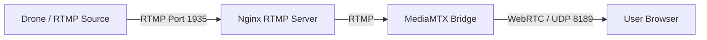

# WebRTC Implementation in Drone-Feed

This project utilizes a **server-side bridge approach** to deliver low-latency video via WebRTC. Instead of implementing a custom WebRTC signaling server and client from scratch, it leverages [MediaMTX](https://github.com/bluenviron/mediamtx) to ingest the drone's RTMP stream and serve it as WebRTC.

## Architecture Overview

The video pipeline flows as follows:



## Detailed Component Breakdown

### 1. The Media Server (MediaMTX)
The core of the WebRTC implementation is the `mediamtx` service defined in `docker-compose.yml`.

*   **Role**: Acts as a bridge. It converts the incoming RTMP stream into a format suitable for WebRTC and handles the signaling (SDP exchange) and ICE candidates.
*   **Configuration** (`mediamtx.yml`):
    *   `webrtc: yes`: Enables the WebRTC listener.
    *   `source: rtmp://rtmp/live/drone`: Tells MediaMTX to pull the live video feed from the Nginx RTMP container.
    *   `webrtcAddress: :8889`: The port used for the HTTP-based signaling and player page.
    *   `webrtcLocalUDPAddress: :8189`: The port used for the actual media transport (ICE/UDP).

### 2. The Frontend (Client)
The frontend implementation in `web/index.html` is extremely lightweight because it delegates the WebRTC complexity to MediaMTX's built-in player.

*   **Implementation**: It uses an `<iframe>` to embed the MediaMTX player.
*   **Code**:
    ```html
    <iframe id="webrtcFrame" allow="autoplay; fullscreen"></iframe>
    <script>
      const host = window.location.hostname || "localhost";
      const webrtcUrl = `http://${host}:8889/drone`;
      document.getElementById("webrtcFrame").src = webrtcUrl;
    </script>
    ```
*   **How it works**:
    1. The browser loads `index.html`.
    2. The iframe loads `http://<host>:8889/drone`.
    3. MediaMTX serves a pre-built HTML page inside that iframe.
    4. This internal page executes JavaScript (provided by MediaMTX) to:
        *   Establish a WebSocket or HTTP connection for signaling.
        *   Exchange SDP offers/answers.
        *   Establish the WebRTC PeerConnection.
        *   Render the `<video>` element.

## Comparison with Custom WebRTC

| Feature | This Implementation (MediaMTX) | Custom Implementation |
| :--- | :--- | :--- |
| **Complexity** | Low (Config-based) | High (Requires custom Signaling, ICE handling) |
| **Client Code** | `<iframe>` (No JS logic) | `RTCPeerConnection` API, Signaling logic |
| **Latency** | Low (< 500ms) | Low (< 500ms) |
| **Flexibility** | Limited to MediaMTX features | Unlimited (Custom UI, Data Channels) |

## Key Files
*   **`mediamtx.yml`**: Configures the Webrtc/RTMP bridging logic.
*   **`docker-compose.yml`**: Runs the `mediamtx` binary.
*   **`web/index.html`**: Embeds the player.
